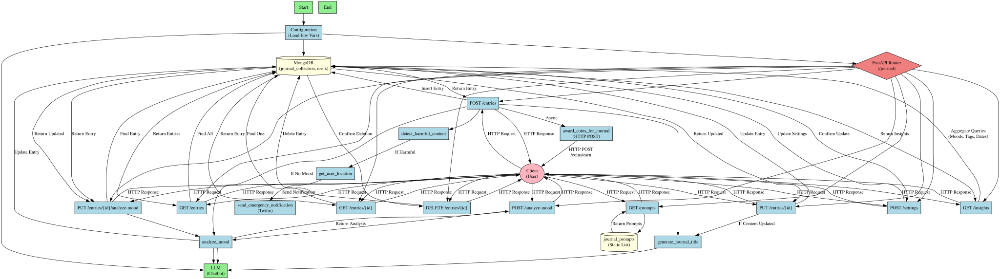

# 🧘 ZenHeaven – A Holistic Mental Wellness Platform

Welcome to **ZenHeaven**, an AI-powered digital platform designed to provide personalized, accessible, and stigma-free mental health support. ZenHeaven brings together therapy, self-care tools, and community features to create a safe, supportive, and empowering environment for anyone struggling with stress, anxiety, or emotional challenges.

---

## 🚀 **DEPLOYMENT GUIDE - Deploy to Vercel**

### **Prerequisites**
- Node.js 18+ 
- A deployed FastAPI backend (Railway, Render, etc.)
- Vercel account

### **Step 1: Prepare for Deployment**
Your project is now configured with:
- ✅ Environment variable support (`VITE_API_URL`)
- ✅ Vercel configuration (`vercel.json`)
- ✅ Optimized Vite build settings
- ✅ All hardcoded localhost URLs updated

### **Step 2: Deploy Your Backend First**
Choose one of these platforms for your FastAPI backend:

**Option A: Railway**
1. Push your `/api` folder to GitHub
2. Connect to Railway
3. Deploy automatically
4. Get your backend URL

**Option B: Render**
1. Connect your GitHub repo
2. Set Python environment
3. Deploy with `uvicorn main:app --host 0.0.0.0 --port $PORT`

**Option C: Heroku**
1. Create `Procfile`: `web: uvicorn main:app --host 0.0.0.0 --port $PORT`
2. Deploy via Git

### **Step 3: Deploy Frontend to Vercel**

**Method 1: Vercel CLI**
```bash
# Install Vercel CLI
npm i -g vercel

# Deploy from project root
vercel --prod

# Set environment variable when prompted:
# VITE_API_URL=https://your-backend-url.com
```

**Method 2: GitHub Integration**
1. Push code to GitHub repository
2. Go to [vercel.com](https://vercel.com)
3. "Import Project" → Connect GitHub
4. Select your repository
5. **Set Environment Variables:**
   - Key: `VITE_API_URL`
   - Value: `https://your-backend-url.com`
6. Click "Deploy"

### **Step 4: Environment Variables**

**Frontend (Vercel Dashboard):**
```
VITE_API_URL=https://your-backend-url.com
```

**Backend Environment Variables:**
```
DATABASE_URL=your-mongodb-connection-string
JWT_SECRET=your-jwt-secret
OPENAI_API_KEY=your-openai-key
```

### **Step 5: Test Your Deployment**
1. Visit your Vercel URL
2. Test login/register functionality
3. Check API connections
4. Verify all features work

---

## 🌟 Problem Statement – *The Mental Health Gap*

- Mental health issues like stress, anxiety, and depression are rapidly increasing.
- Traditional therapy is often expensive, inaccessible, or socially stigmatized.
- There is no unified platform that combines therapy, self-care, and community support.
- People lack consistent and personalized emotional guidance in times of need.

---

## 💡 Our Solution – What ZenHeaven Offers

| Feature                        | Description                                                                 |
|-------------------------------|-----------------------------------------------------------------------------|
| 🧑‍⚕️ 1-on-1 Therapy Sessions   | Connect with licensed professionals via secure video calls.                 |
| 🎧 Mindful Music Playlist     | AI-powered, mood-based music recommendations for emotional support.         |
| 📓 Journaling & Mood Check-ins| Daily entries to foster self-reflection and track emotional patterns.       |
| 📚 Book Recommendations       | Curated reads for personal growth and mental wellness.                      |
| 🤖 24/7 AI Chatbot            | Offers breathing techniques, instant help, and escalation to counselors.    |

---

## Flowchart
 

## 🛠 Tech Stack

**Frontend:**
- React.js
- Tailwind CSS

**Backend:**
-FastAPI

**Database & Storage:**
- MongoDB
-  Socket.io (Real-time)

**AI Features:**
- Python + TensorFlow for mood detection and personalized suggestions

**Video Calls:**
- Daily.co / Twilio for real-time therapy sessions

## 👥 Team Info

- **Team Name:** Wind Breakers  
- **Project Name:** ZenHeaven 
- **Team Leader:** Vaibhav Mishra  
- **Institute:** KIET Group of Institutions

---

## 📌 License

This project is for educational and demonstration purposes as part of a hackathon. For professional mental health support, users should consult certified professionals.

---
## Frontend — Light Academia

This Vite frontend runs on port 6128 and connects to the FastAPI API through `VITE_API_URL`.
